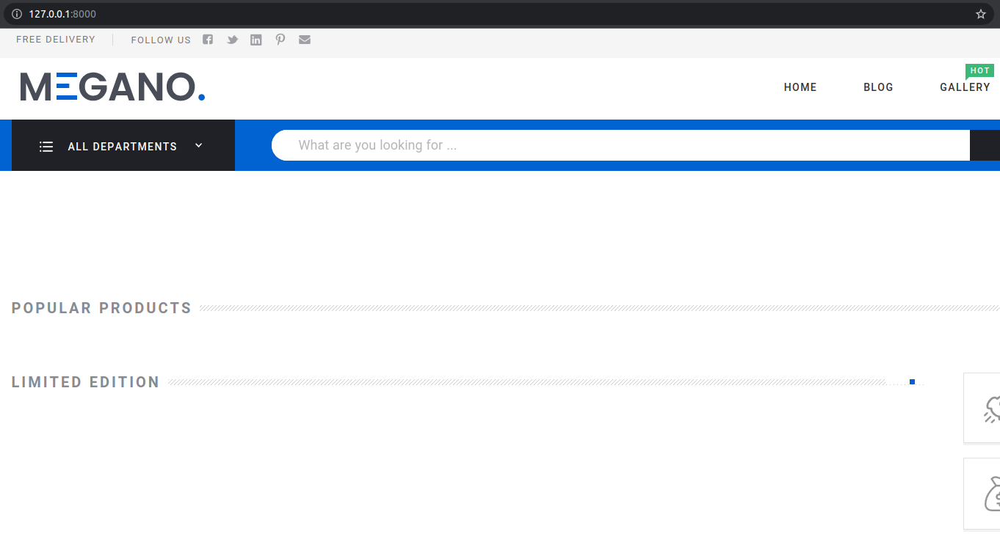

Django_Web-market_Megano
Pet-проект представляет собой интернет-магазин.
Проект разработан на фреймворке Django и он «легкопереносимый». Это значит, что запуск проекта осуществляется путём
клонирования репозитория, установки необходимых зависимостей и выполнения миграции.

РУКОВОДСТВО ПО ЗАПУСКУ ПРОЕКТА НА ЛОКАЛЬНОМ КОМПЬЮТЕРЕ:

Клонируем репозиторий

Переходим в корневую директорию проекта

Создаем виртуальное окружение
`python -m venv venv`

Устанавливаем зависимости: `pip istall -r requirements.txt`

Устанавливаем файлы из архива: `pip install diploma-frontend-0.6.tar.gz`

Поднимаем контейнеры: ``docker-compose up``

Переходим на http://127.0.0.1:8000/ в
браузере, изначально можно будет пользоваться веб-маркетом как незарегистрированный пользователь.

СТРУКТУРА САЙТА:
● Главная страница.
● Каталог с фильтром и сортировкой:
  ○ Сам каталог товаров.
  ○ Детальная страница товара, с отзывами.
● Оформление заказа:
  ○ Корзина.
  ○ Оформление заказа.
  ○ Оплата.
● Личный кабинет:
  ○ Личный кабинет.
  ○ Профиль.
  ○ История заказов.
● Административный раздел:
  ○ Просмотр и редактирование товаров.
  ○ Просмотр и редактирование заказов.
  ○ Просмотр и редактирование категорий каталога.

Роли пользователей:
● Администратор — полный доступ к админке.
● Покупатель — любой авторизованный пользователь, который может пользоваться всеми публичными возможностями системы.
● Незарегистрированный пользователь — может просматривать каталоги и собирать корзину.

Чтобы организовать покупку, необходимо выбрать/добавить товар в корзину, пройти авторизацию/регистрацию по форме,
следовать подсказкам для создания/оплаты заказа.

Суперюзер создается по умолчанию, следовательно открыт доступ к админке по адресу http://127.0.0.1:8000/admin/ , там можно будет
просматривать/редактировать покупателей, заказы, товары

Стек использованных технологий:
● Python
● Django Rest Framework
● Swagger
● HTML/CSS
● MVC/MTV
● ORM
● Docker
